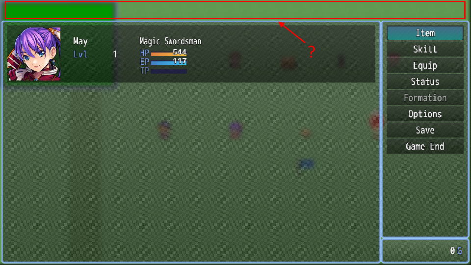
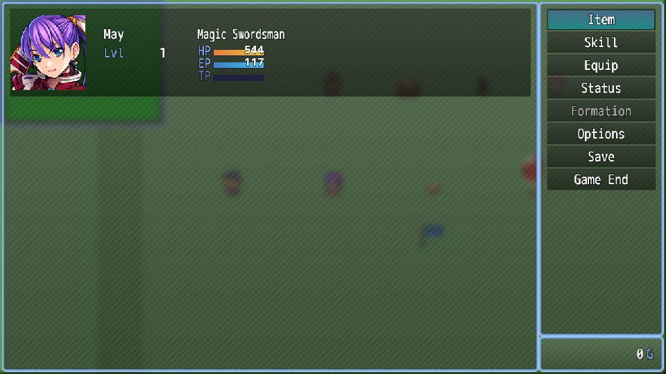
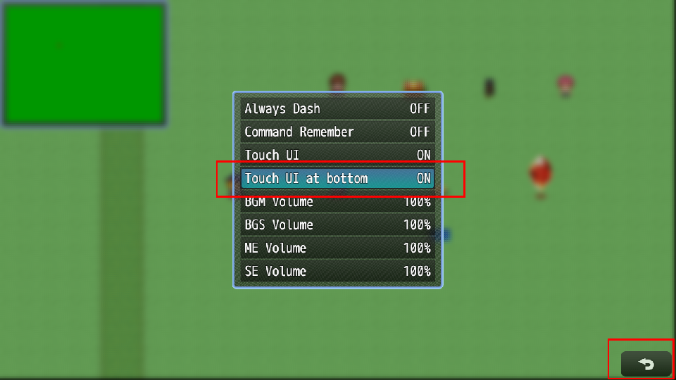
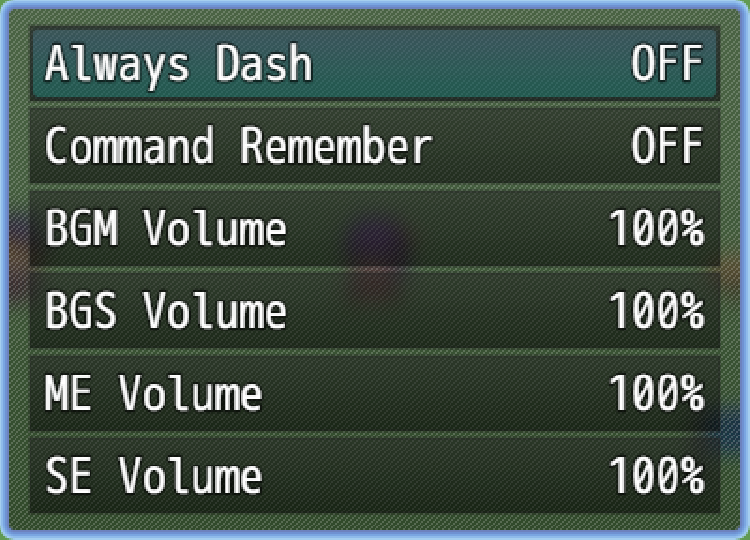

# N_EnhancedTouchUIButton
Adds some improvements to the existing touch UI button.

| Original                                     | N_EnhancedTouchUIButton                  |
| -------------------------------------------- | ---------------------------------------- |
|  |  |

- Fixes menu dimensions when touch UI is disabled (see above screenshot).
- Provides the following touch UI display modes (this does not affect mobiles, as the touch UI will always be visible):
  - Always: Touch UI can not be disabled.
  - User-defined: The default behavior of RPG Maker MZ.
  - Never: Touch UI can not be enabled.
- Adds an option to display the touch UI button at the bottom.  

- Automatically removes "Touch UI" entry from options window depending on the chosen display mode.  

- For user-defined display mode: allows disabling touch UI by default, so that player needs to enable it in the options first. Useful when the primary target audience uses desktops.
- Automatically updates touch UI button when option is changed in the options window. Players can immediately see the effect of turning touch UI on or off, or moving the button to the bottom.

| Project                 | Latest release      |
| ----------------------- | ------------------- |
| N_EnhancedTouchUIButton | [Download][release] |

[All RPG Maker plugins by Nolonar][hub]

## Compatibility
Tested and confirmed working:
- RPG Maker MZ

## Terms of Use
According to [LICENSE](LICENSE).

  [hub]: https://github.com/Nolonar/RM_Plugins
  [release]: https://github.com/Nolonar/RM_Plugins-EnhancedTouchUIButton/releases/latest/download/N_EnhancedTouchUIButton.js
